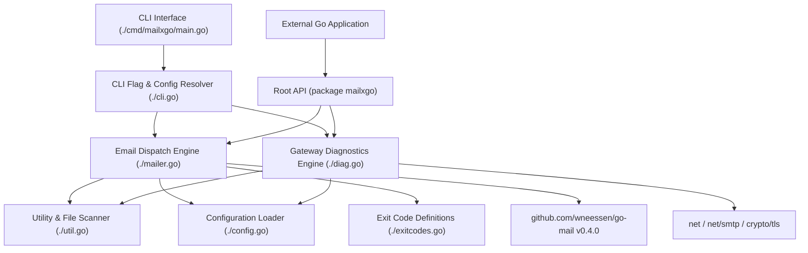
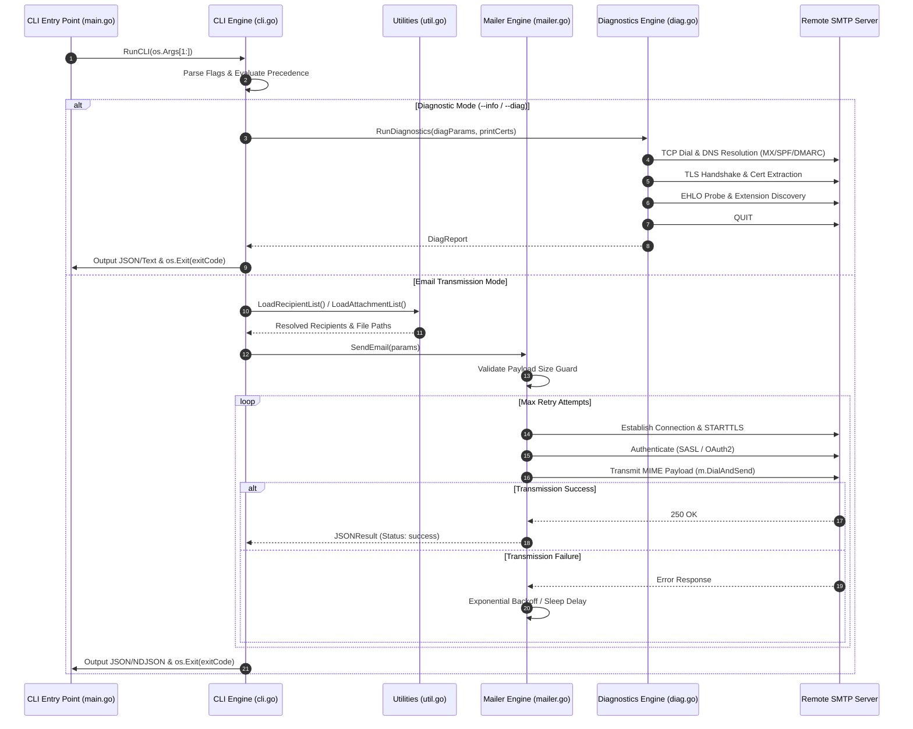
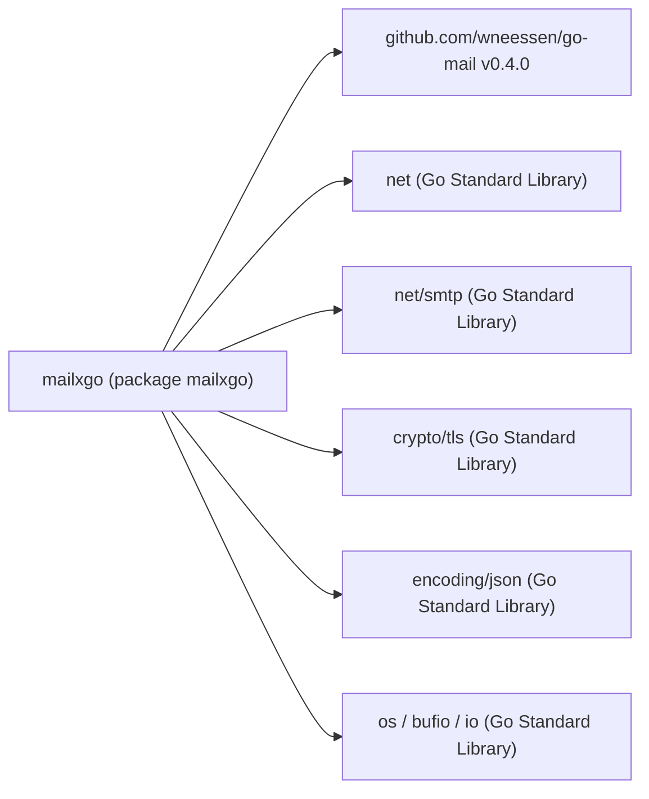
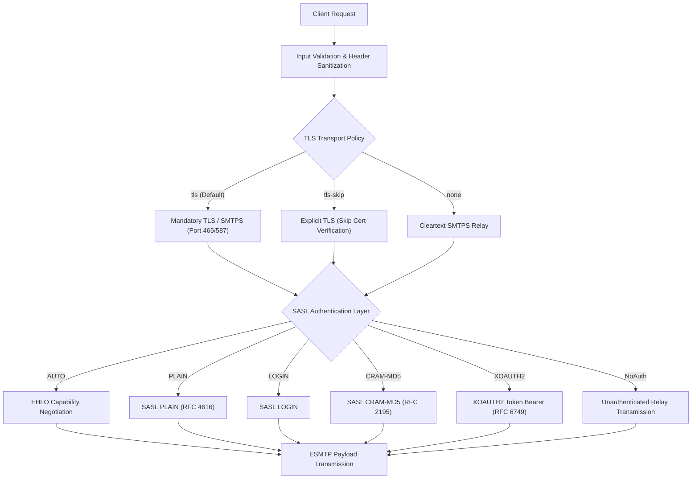

# System Architecture & Technical Specification

## 1. Architecture and Design Choices

### 1.1 System Architecture
`mailxgo` is structured as a dual-interface Go application. It provides both a standalone Command Line Interface (CLI) binary located under `cmd/mailxgo/` and a reusable, programmatic Go module interface exposed directly via root `package mailxgo`.

### 1.2 Core Architectural Principles
* **Separation of Concerns:** Command-line parsing and parameter validation logic are strictly decoupled from core SMTP transport mechanisms and gateway probing functions.
* **Deterministic Configuration Precedence:** Parameter evaluation follows a strict six-tier hierarchy:
  $$\text{CLI Short Flags} > \text{CLI Long Flags} > \text{JSON Configuration File} > \text{Environment Variables} > \text{Provider Presets} > \text{Built-in Defaults}$$
* **Non-Blocking Resource Pre-Validation:** Payload sizes and attachment paths are evaluated prior to establishing network sockets. If payload boundaries exceed limits, execution terminates without initiating remote TCP sessions.
* **Deterministic Granular Exit Status:** System exit codes are categorized into granular numeric ranges (`ExitSuccess = 0`, `ExitErrUsage = 2`, `ExitErrConfig = 3`, `ExitErrFileIO = 4`, `ExitErrDNS = 5`, `ExitErrTLS = 6`, `ExitErrAuth = 7`, `ExitErrSend = 8`) to allow deterministic process supervision in enterprise job schedulers.

### 1.3 Architectural Assumptions & Edge Cases
* **Network Infrastructure:** Assumes standard IPv4/IPv6 TCP socket connectivity to target SMTP relays on ports 25, 465, 587, or custom ports.
* **Authentication Fallbacks:** If explicit SASL parameters are unspecified, authentication negotiation automatically analyzes remote ESMTP capability advertisements (`EHLO`) to select supported SASL mechanisms (`PLAIN`, `LOGIN`, `CRAM-MD5`, `XOAUTH2`).
* **Line Ending Normalization (Cross-Platform):** File scanners in `util.go` normalize CRLF (`\r\n`) and LF (`\n`) input vectors via `bufio.Scanner` and line sanitization to prevent header injection or trailing character corruption on Windows systems.
* **Header Injection Mitigation:** Custom MIME headers set via CLI arguments or JSON configuration files are sanitized to reject control characters (`\r`, `\n`), enforcing compliance with RFC 5322 section 2.2.

---

## 2. Data Flow and Control Logic

### 2.1 Operational Flow & Code Relations

### 2.2 Data Sequence Specifications
1. **Invocation:** CLI arguments are ingested by `flag.FlagSet` in `cli.go`.
2. **Environment & File Overrides:** `os.Getenv` queries environment variable fallbacks (`MAILXGO_SMTP_PASSWORD`, `MAILXGO_SMTP_USERNAME`, `MAILXGO_OAUTH_TOKEN`) and optional JSON configuration files parsed via `json.NewDecoder`.
3. **Recipient & File Ingestion:** List files and attachment directories are parsed line-by-line via `bufio.Scanner` in `util.go`.
4. **MIME Construction:** `github.com/wneessen/go-mail` constructs multipart MIME structures (`multipart/mixed`, `multipart/related`, `multipart/alternative`).
5. **Transport & Delivery:** Socket operations are managed synchronously with automated retry loops and logging output to `os.Stderr`, `stdout`, or specified audit files.

---

## 3. Performance and Scalability

### 3.1 Concurrency & Execution Model
* **Execution Model:** `mailxgo` operates as a single-process, low-overhead utility designed for predictable execution in containerized job agents and CLI environments.
* **Streamed Memory Management:** File list processing (`LoadRecipientList`, `LoadAttachmentList`) uses buffered streaming (`bufio.Scanner`) rather than full-file memory buffering, maintaining low memory footprints even when evaluating large recipient datasets.
* **Socket Timeouts & Resource Management:** All network dial operations are governed by context timeouts (`time.Duration(timeout) * time.Second`). Open file descriptors and network connections are guaranteed to close via deferred execution calls (`defer file.Close()`, `defer conn.Close()`).

### 3.2 Resilience and Retry Backoff
* **Dial Retry Loop:** Failed network attempts execute a bounded retry loop governed by `--retries` and `--retry-delay` settings.
* **Pre-Dial Payload Inspection:** File size calculations prevent resource consumption on target SMTP servers by aborting invalid payloads locally before socket establishment.

---

## 4. Dependencies

### 4.1 Dependency Graph

### 4.2 Module Inventory
* **Core Transport Engine:** `github.com/wneessen/go-mail v0.4.0` (Native Go ESMTP implementation, maintained, zero external indirect dependencies).
* **Standard Library Dependencies:** `net`, `net/smtp`, `crypto/tls`, `encoding/json`, `os`, `bufio`, `path/filepath`, `strings`, `flag`, `fmt`, `sort`, `strconv`, `time`.

---

## 5. Security Architecture

### 5.1 Security Layers & Authentication Mechanisms

### 5.2 Access Control & Privilege Management
* **Unprivileged Execution Context:** `mailxgo` requires no superuser or root privileges. It runs entirely within standard unprivileged user spaces (`uid/gid`).
* **Secret Isolation:** Cleartext passwords and OAuth access tokens can be passed via environment variables (`MAILXGO_SMTP_PASSWORD`, `MAILXGO_OAUTH_TOKEN`) or process pipes to avoid exposure in process listing tables (`ps aux`).
* **Input Sanitization:** MIME header injection protection prevents injection of CRLF sequences (`\r\n`) in header fields.
