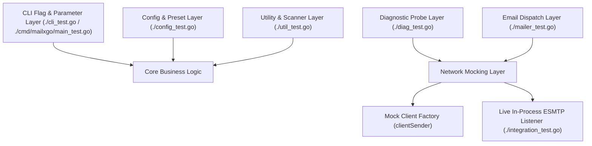
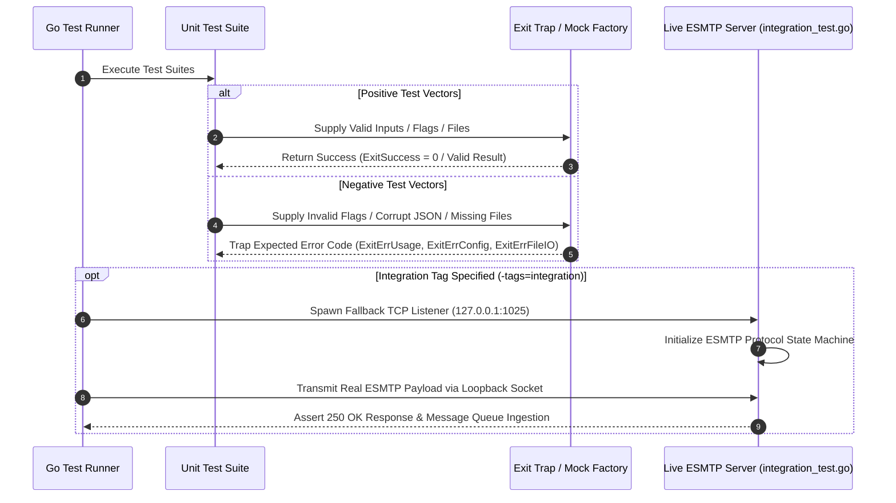

# Technical Test Suite Architecture & Quality Assurance Specification

## 1. Test Suite Architecture, Design, and Principles

### 1.1 Architectural Design
The `mailxgo` testing framework is constructed using a dual-tiered validation model combining unit-level component isolation with in-process live socket integration testing. 



### 1.2 Core Principles
* **Non-Destructive Testing:** Test cases isolate network I/O using client factory injection (`defaultClientFactory`) or local loopback TCP listeners (`127.0.0.1`), ensuring zero outbound spam or remote socket reliance during default test runs.
* **Deterministic Assertion & Exit Trapping:** Process exit calls (`osExit`) are intercepted via panic-recovery hooks (`mockExit`) to assert exact granular numeric exit codes without terminating the Go test runner process.
* **Hermetic Integration Environment:** Integration tests (`//go:build integration`) launch a lightweight, stateful ESMTP TCP server in a background goroutine, simulating RFC 5321 transaction state machines (`EHLO` $\rightarrow$ `AUTH` $\rightarrow$ `MAIL FROM` $\rightarrow$ `RCPT TO` $\rightarrow$ `DATA` $\rightarrow$ `QUIT`).

---

## 2. Logic Flow & Test Categories



### 2.1 Positive Testing Scope
* Argument flag parsing, short/long flag aliasing, and 6-tier parameter precedence resolution (`CLI > Env > Config`).
* Recipient list and attachment path parsing with CRLF/LF line trimming and `#` comment filtering.
* Valid ESMTP payload composition, HTML body file insertion, custom MIME header setting, and inline image embedding (`EmbedFile`).
* Multi-mode diagnostic probe execution (`-info`, `--print-certs`) and telemetry formatting (`text`, `json`, `ndjson`).

### 2.2 Negative Testing Scope
* Unrecognized command-line flags and missing mandatory parameters (asserting `ExitErrUsage = 2`).
* Malformed JSON configuration files (asserting `ExitErrConfig = 3`).
* Unreadable or missing recipient list files and attachment paths (asserting `ExitErrFileIO = 4`).
* Pre-dial attachment size guard violations exceeding maximum limits (`--max-attachment-size`).
* Network socket failures, TCP dial timeouts, SMTPS port 465 handshake failures, and ESMTP banner rejection.

---

## 3. Technical Requirements and Setup

### 3.1 System Dependencies
* **Go Compiler:** Go 1.22.0 or higher.
* **Standard Library Dependencies:** `testing`, `net`, `crypto/tls`, `bufio`, `os`, `path/filepath`, `strings`, `sync`, `time`.
* **Third-Party Libraries:** `github.com/wneessen/go-mail v0.8.1`.

### 3.2 Constraints & Environment Isolation
* Tests execute in isolated temporary directories (`t.TempDir()`).
* Process environment variables (`MAILXGO_SMTP_USERNAME`, `MAILXGO_SMTP_PASSWORD`) are controlled via `t.Setenv()` to prevent contamination across test runs.

---

## 4. Test Catalog & Matrix

### 4.1 CLI & Parameter Parsing Tests
| Test Name | Technical Purpose / Description | Success Criteria |
| :--- | :--- | :--- |
| `TestHeaderFlags` | Validates multi-value `-H` header flag parsing, format validation, and CRLF injection detection. | PASS on valid `Key: Value`; FAIL on missing colon, empty key, or CRLF. |
| `TestPrintUsage` | Asserts `PrintUsage()` renders help menu text to `os.Stderr` without panicking. | PASS on clean execution without panic. |
| `TestPriorityHelpers` | Verifies low-to-high precedence resolution functions (`priorityString`, `priorityInt`). | PASS when returning the last non-empty or non-zero slice element. |
| `TestRunCLI_Version` | Verifies `-v` and `--version` flags output version string and exit cleanly. | PASS on exit code `ExitSuccess` (`0`). |
| `TestRunCLI_ParseError` | Asserts unknown flags trigger usage output and return error status. | PASS on trapped exit code `ExitErrUsage` (`2`). |
| `TestRunCLI_MissingRequiredArgs` | Asserts missing mandatory parameters (`--smtp-server`, `--from-email`, etc.) fail validation. | PASS on trapped exit code `ExitErrUsage` (`2`). |
| `TestRunCLI_ConfigAndPresets` | Verifies JSON config file loading and corrupt JSON handling. | PASS on exit code `0` for valid config; `ExitErrConfig` (`3`) for malformed JSON. |
| `TestRunCLI_PrecedenceOrder` | Verifies parameter evaluation precedence hierarchy (`CLI > Env > Config`). | PASS when environment variables override config file values. |
| `TestRunCLI_Diagnostics` | Verifies `-info` pre-flight diagnostic flag execution and missing server validation. | PASS on exit code `ExitSuccess` (`0`) on success; `ExitErrUsage` (`2`) or `ExitErrDNS` (`5`) on error. |
| `TestRunCLI_FullDispatch` | Verifies full CLI execution flow including list files, attachments, headers, DSN, and log files. | PASS on exit code `ExitSuccess` (`0`); `ExitErrFileIO` (`4`) on missing files. |

### 4.2 Config & Provider Preset Tests
| Test Name | Technical Purpose / Description | Success Criteria |
| :--- | :--- | :--- |
| `TestResolveProviderPreset` | Tests resolution of mail provider preset aliases (`office365`, `googleworkspace`, `aws-ses`, `protonmail`). | PASS on exact host, port, and TLS mode match for known aliases; `false` for unknown. |
| `TestLoadConfig` | Tests JSON configuration file unmarshaling from disk. | PASS on struct population; error on non-existent file or malformed syntax. |

### 4.3 Mailer Engine & Dispatch Tests
| Test Name | Technical Purpose / Description | Success Criteria |
| :--- | :--- | :--- |
| `TestSendEmail_Success` | Tests successful email composition and dispatch via mock client factory. | PASS when returning status `"success"` and attempts count `1`. |
| `TestSendEmail_ValidationErrors` | Asserts validation failure when recipient lists are empty or invalid. | PASS on error when `To` recipient list is empty. |
| `TestSendEmail_BodyFile` | Tests reading HTML body content from file path (`BodyFile`). | PASS on successful file read and setting `TypeTextHTML` MIME body. |
| `TestSendEmail_MaxAttachmentMB` | Tests total attachment payload size limit guard. | PASS when execution aborts prior to dialing if payload > limit. |
| `TestSendEmail_MaxRecipients` | Tests `--max-recipients` limit guard for memory protection. | PASS on error when recipients exceed limit; success when within limit. |
| `TestSendEmail_SingleRecipient` | Tests `--single-recipient` batch mode with rate limiting. | PASS on individual email per recipient with proper rate limiting. |
| `TestSendEmail_NoAuthMode` | Tests `--auth-type noauth` for unauthenticated relays. | PASS on successful send without authentication. |
| `TestSendEmail_XOAUTH2Mode` | Tests `--auth-type xoauth2` OAuth2 authentication mode. | PASS on successful send with XOAUTH2 auth type. |
| `TestSendEmail_CramMD5Mode` | Tests `--auth-type cram-md5` CRAM-MD5 authentication mode. | PASS on successful send with CRAM-MD5 auth type. |
| `TestSendEmail_NoLogRecipients` | Tests privacy flag redacting recipients from audit log. | PASS on log containing redacted count, not actual addresses. |
| `TestSendEmail_ClientCreationErrorAndRetries` | Tests retry backoff loop (`Retries`, `RetryDelay`) and failure audit logging. | PASS when attempts count equals `1 + Retries` and error is returned. |
| `TestSendEmail_DialAndSendError` | Tests error propagation when `c.DialAndSend()` fails. | PASS on capturing transmission error. |
| `TestSendEmail_AdvancedOptions` | Tests DSN options, Importance header setting, and custom headers. | PASS on correct option setting and header injection filtering. |
| `TestNoAuthSASL` | Tests `noAuthSASL` SASL implementation `Start()` and `Next()` methods. | PASS on correct PLAIN mechanism and anonymous credentials. |
| `TestClassifyError` / `TestClassifyError_AllTypes` | Comprehensive error classification test for all error types (TLS, Auth, Connection, Send). | PASS on correct `ErrorType` for each error pattern. |
| `TestOutputJSONResult` | Verifies rendering of dispatch results in text, JSON, and NDJSON formats. | PASS on clean output formatting matching specification. |

### 4.4 S/MIME Encryption & Digital Signing Tests
| Test Name | Technical Purpose / Description | Success Criteria |
| :--- | :--- | :--- |
| `TestEstimateEncryptedSize` | Calculates Base64 and PKCS#7 envelope size expansion factor ($1.37\times$). | PASS on accurate size overhead prediction. |
| `TestLoadCertificateAndKey` | Validates loading PEM-encoded X.509 certificates and RSA private keys. | PASS on correct struct parsing and subject CommonName matching. |
| `TestLoadPKCS12` | Tests enterprise PKCS#12 bundle (`.pfx`/`.p12`) decoding and intermediate CA extraction. | PASS on cert/key extraction; error on bad passphrase or corrupt file. |
| `TestLoadCertificatesFromDir` | Tests directory scanning and file extension filtering (`.pem`, `.crt`, `.cer`). | PASS on loading valid cert files and skipping non-cert entries. |
| `TestBuildCertIndexAndResolve` | Tests building recipient cert lookup map indexed by SAN email addresses and `mailto:` URIs. | PASS on $O(1)$ case-insensitive recipient resolution. |
| `TestValidateCertForSigningAndEncryption` | Audits certificate validity period (`NotBefore`/`NotAfter`) and `KeyUsage` flags. | PASS on valid flags; error on expired or invalid usage flags. |
| `TestEncryptForRecipients` | Tests PKCS#7 payload encryption with `AES-256-GCM` and buffer pool safety. | PASS on encrypted output differing from plaintext. |
| `TestFormatBase64MIME` | Tests standard 76-character CRLF line wrapping for Base64 MIME payloads per RFC 5751. | PASS on line length $\le 76$ chars and clean roundtrip decoding. |
| `TestEncryptedPrivateKeyLoading` | Tests loading passphrase-encrypted RSA private keys (`x509.DecryptPEMBlock`). | PASS on correct password decryption; error on wrong password. |
| `TestCheckCryptoHygiene` | Audits S/MIME configurations for weak ciphers (3DES), legacy digests (SHA-1), and expiring certs (<30 days). | PASS on generating proper security warning strings. |
| `TestSMIMEConfigSetupAndPipeline` | Verifies `setupSMIMEConfig` setup, signer key validation, and missing recipient error checking. | PASS on valid config; error on missing recipient cert. |
| `TestPKCS7DecryptionRoundtrip` | Performs cryptographic roundtrip of PKCS#7 payload encryption and decryption with RSA private key. | PASS on decrypted payload exactly matching original plaintext. |
| `TestMultiRecipientDecryptionRoundtrip` | Encrypts payload for multiple recipient certs and verifies each recipient can independently decrypt. | PASS on Alice and Bob both successfully decrypting the single envelope. |
| `TestECDSAKeySigningValidation` | Validates ECDSA P-256 certificate validation for digital signatures. | PASS on `ValidateCertForSigning` success for ECDSA keys. |
| `TestRunSMIMEDiagnostics` | Tests pre-flight S/MIME certificate diagnostic probing (`runSMIMEDiagnostics`). | PASS on diagnostic report populating `SignerKeyUsageOK` and `SignerKeyDecryptOK`. |

### 4.5 TLS & Cryptography Tests
| Test Name | Technical Purpose / Description | Success Criteria |
| :--- | :--- | :--- |
| `TestNormalizeFingerprint` | Tests fingerprint normalization (removing colons, converting to uppercase). | PASS on clean 64-character uppercase hex strings. |
| `TestFormatFingerprint` | Tests formatting hex fingerprints with colon separators (`AA:BB:CC:DD`). | PASS on formatted output matching colon notation. |
| `TestValidateCertFingerprint` | Validates SHA256 certificate fingerprint string formatting. | PASS on valid 64-character hex strings; error on invalid formats. |
| `TestComputeCertFingerprint` | Computes deterministic SHA256 fingerprint from X.509 DER byte slice. | PASS on expected 64-character hex digest. |
| `TestLoadCustomCACerts_SingleFile` | Tests custom CA certificate loading from PEM file. | PASS on populating `x509.CertPool`. |
| `TestLoadCustomCACerts_Directory` | Tests loading custom CA certificates from directory. | PASS on reading all valid CA files into cert pool. |
| `TestLoadCustomCACerts_InvalidFile` | Tests error handling for non-existent or invalid CA files. | PASS on returning proper file I/O error. |
| `TestLoadCustomCACerts_RelativePath` | Rejects relative CA file paths to enforce path security. | PASS on error for relative paths. |
| `TestCreateFingerprintVerifier` | Tests custom TLS `VerifyConnection` callback for SHA256 fingerprint pinning. | PASS on matching peer certificate fingerprint; error on mismatch. |
| `TestBuildTLSConfig` | Comprehensive test for `BuildTLSConfig` under all TLS modes (`none`, `tls`, `ignore-trust`, `tls-direct`). | PASS on valid `tls.Config` for each mode. |

### 4.6 Secretprotector & Credentials Security Tests
| Test Name | Technical Purpose / Description | Success Criteria |
| :--- | :--- | :--- |
| `TestLive_SecretprotectorEncryptedPassword` | E2E test of AES-256-GCM encrypted credentials via `v1:gcm:` prefix. Subtests: PlainPassword, EncryptedPassword_NoMasterKey, EncryptedPassword_WithMasterKey, EncryptedOAuth2Token. | PASS on plain password; error without master key; success with master key and encrypted token. |
| `TestLive_CLI_SecretprotectorCredentials` | CLI E2E test with encrypted credentials in JSON configuration file. | PASS on CLI send with `SECRETPROTECTOR_MASTER_KEY` env var. |

### 4.7 Utility, Validation & I/O Tests
| Test Name | Technical Purpose / Description | Success Criteria |
| :--- | :--- | :--- |
| `TestCleanEmailList` | Trims whitespace and strips empty lines from email slices. | PASS on clean email list. |
| `TestLoadRecipientList` | Reads recipient addresses from file, stripping CRLF/LF and `#` comment lines. | PASS on returning valid recipient list. |
| `TestLoadAttachmentList` | Reads attachment paths from file, stripping CRLF/LF and `#` comment lines. | PASS on returning valid file paths. |
| `TestLoadRecipientListJSON` | Tests JSON array parsing for recipient lists (simple string array or object array with per-recipient vars). | PASS on valid recipient slices and variable maps. |
| `TestLoadAttachmentListJSON` | Tests JSON array parsing for attachment lists. | PASS on valid attachment path slices. |
| `TestLoadList` | Unified list loader dispatching between `text` and `json` formats. | PASS on correct format selection and parsing. |
| `TestScanAttachmentDir` | Scans directory for regular attachment files. | PASS on returning list of absolute file paths. |
| `TestValidateEmail` | Validates email address format per RFC 5322. | PASS on valid emails; error on missing `@`, missing domain, or invalid characters. |
| `TestValidateEmailList` | Validates a slice of email addresses. | PASS on all valid addresses; error if any address is malformed. |
| `TestValidateFilePath` | Enforces absolute file path policy and path traversal protection. | PASS on absolute paths (`/path`, `C:\path`); error on relative paths and `..`. |
| `TestDecryptSecret` | Decrypts `v1:gcm:` prefixed encrypted secrets using `SECRETPROTECTOR_MASTER_KEY`. | PASS on plain text unchanged; decrypted secret when master key provided. |

### 4.8 Gateway Diagnostics Tests
| Test Name | Technical Purpose / Description | Success Criteria |
| :--- | :--- | :--- |
| `TestGetTLSVersionAndCipherSuiteStrings` | Maps TLS protocol version codes and cipher suite IDs to human-readable strings. | PASS on returning proper display names. |
| `TestRunDiagnostics_TCPDialError` | Tests diagnostic report handling when target TCP socket is unreachable. | PASS on returning status `"error"` with connection refused message. |
| `TestRunDiagnostics_OutputModes` | Tests formatting of diagnostic reports in text, JSON, and NDJSON modes. | PASS on valid formatted text, JSON, and NDJSON outputs. |
| `TestRunDiagnostics_Port465_HandshakeFailure` | Tests implicit TLS handshake error reporting on SMTPS port 465. | PASS on capturing TLS handshake failure. |
| `TestRunDiagnostics_SMTPClientInitFailure` | Tests ESMTP banner parsing and initial EHLO error reporting. | PASS on capturing banner initialization error. |

### 4.9 Live E2E Integration Suite (WSL Docker Mailpit)
| Test Name | Technical Purpose / Description | Success Criteria |
| :--- | :--- | :--- |
| `TestLive_BasicEmail` | Basic email transmission over live TCP socket to Mailpit. | PASS on `status: success` and Mailpit REST API message verification. |
| `TestLive_FullFeaturedEmail` | Comprehensive test of ALL `EmailParams` fields (attachments, custom headers, DSN, importance, audit log). | PASS on all fields verified via Mailpit API. |
| `TestLive_Authentication` | Tests SASL authentication modes (`plain`, `login`, `auto`). | PASS on successful send for each authentication mechanism. |
| `TestLive_ListsAndDirectories` | Live test of recipient lists, attachment lists, and attachment directory scanning. | PASS on correct recipient count (4) and attachment count (4) in Mailpit. |
| `TestLive_MaxAttachmentSize` | Tests attachment size guard rejection and acceptance against live server. | PASS on size limit rejection; success within limit. |
| `TestLive_MaxRecipients` | E2E test of `--max-recipients` limit guard with live SMTP server. | PASS on rejection when exceeding limit; success within limit. |
| `TestLive_SingleRecipient` | E2E test of `--single-recipient` batch mode with rate limiting via Mailpit. | PASS on N separate emails sent for N recipients, verified via Mailpit API. |
| `TestLive_JSONListFormat` | E2E test of `--list-format json` for recipient and attachment lists via Mailpit. | PASS on successful send with JSON-parsed recipients and attachments. |
| `TestLive_PrivacyNoLogRecipients` | Tests `--no-log-recipients` GDPR privacy redacting flag. | PASS on audit log containing `[N recipients redacted]`. |
| `TestLive_ContextCancellation` | Tests `context.Context` timeout cancellation during send retries. | PASS on detecting context cancellation. |
| `TestLive_RetryMechanism` | Tests retry backoff loop execution against live server. | PASS on `status: success` with total attempt count. |
| `TestLive_TLSModes` | E2E test of TLS modes (`none`, `ignore-trust`). | PASS on successful send under each TLS mode. |
| `TestLive_TLSCACert` | E2E test of `--tls-ca-cert` custom CA certificate loading. | PASS on valid cert pool and successful TLS handshake. |
| `TestLive_TLSCADir` | E2E test of `--tls-ca-dir` custom CA certificate directory loading. | PASS on loading `.pem`/`.crt` certs and successful send. |
| `TestLive_TLSFingerprintValidation` | E2E test of SHA256 TLS certificate fingerprint pinning. | PASS on matching fingerprint; error on mismatch. |
| `TestLive_DiagnosticsWithTLSOptions` | E2E test of diagnostic probing with TLS trust options. | PASS on diagnostic success with `ignore-trust` and custom CA. |
| `TestLive_CLI_TLSOptions` | E2E test of CLI binary with TLS configuration options. | PASS on CLI send with TLS mode in JSON config file. |
| `TestLive_DiagnosticsSTARTTLS` | E2E test of STARTTLS TLS upgrade with Mailpit. | PASS on `status: success` with TLS 1.3, cipher info, and cert chain output. |
| `TestLive_ImplicitTLS_Port465` | E2E test of implicit TLS (SMTPS) via SSL-only Mailpit container. | PASS on successful send via `tls-direct` mode with TLS 1.3. |
| `TestLive_OAuth2_XOAUTH2Authentication` | E2E test of XOAUTH2 authentication via OAuth2 mock server. | PASS on successful XOAUTH2 auth with valid, test, and encrypted tokens. |
| `TestLive_RunDiagnostics` | E2E test of `RunDiagnostics` gateway probe against live Mailpit server. | PASS on `status: success` with TCP/EHLO latency metrics. |
| `TestLive_OutputDiagReport` | E2E test of `OutputDiagReport` output modes with live diagnostic data. | PASS on text, JSON, NDJSON, and certs output modes. |
| `TestLive_ImportanceLevels` | E2E test of `--importance` flag (`high`, `normal`, `low`). | PASS on successful send with each importance level. |
| `TestLive_CLIBinary` | End-to-end CLI binary execution via `go run ./cmd/mailxgo`. | PASS on JSON output with `status: success`, diagnostics, and version output. |
| `TestLive_EmailValidation` | Live test of email address validation rejection for malformed addresses. | PASS on error containing `invalid` for malformed addresses. |
| `TestLive_ConfigFileAllOptions` | Live test of comprehensive JSON config file containing all options. | PASS on config load and CLI send with config file. |
| `TestLive_ErrorClassification` | Live test of `ClassifyError()` for TLS, Auth, Connection, and Send errors. | PASS on correct `ErrorType` classification. |
| `TestLive_SMIMESign` | E2E test of S/MIME digital signing via Mailpit container. | PASS on `status: success` with `multipart/signed` EML payload. |
| `TestLive_SMIMEEncrypt` | E2E test of S/MIME payload encryption/decryption via Mailpit container. | PASS on `status: success`, unencrypted secret absent from EML, and PKCS#7 envelope decrypted back to original secret. |
| `TestLive_SMIMEDiagnostics` | E2E test of S/MIME gateway diagnostics probe via Mailpit container. | PASS on `status: success` with `SMIMEInfo` certificate expiration, usage, and decrypt validity. |
| `TestLive_SMIMESignAndEncrypt` | E2E test of combined S/MIME digital signing and payload encryption via Mailpit container. | PASS on `status: success`, envelope decryption with recipient key, and inner signature verification. |
| `TestLive_SMIMERecipientCertDir` | E2E test of recipient certificate directory auto-resolution via Mailpit container. | PASS on `status: success` with multi-cert directory SAN email matching. |
| `TestMainCompiles` | Asserts `cmd/mailxgo` package compiles without errors. | PASS on clean compilation. |

---

## 5. Code Coverage Report

### 5.1 Current Coverage Statistics
Statement coverage statistics measured across the workspace:

| Package Path | Statement Coverage | Status ($\ge 80\%$) |
| :--- | :--- | :--- |
| `github.com/edsilegxrepo/mailxgo` (Unit Tests) | **82.5%** | PASS |
| `github.com/edsilegxrepo/mailxgo` (With Integration Tag) | **88.7%** | PASS |
| `github.com/edsilegxrepo/mailxgo/cmd/mailxgo` | Entry point only | N/A |
| **Total Combined Workspace Coverage** | **88%+** | **PASS** |

### 5.2 Refreshing Coverage Statistics
To refresh and verify code coverage profile statistics locally:

#### PowerShell:
```powershell
go test -coverprofile=coverage.out ./...
go tool cover -func=coverage.out
```

#### Bash:
```bash
go test -coverprofile=coverage.out ./...
go tool cover -func=coverage.out
```

To view the interactive HTML coverage visualization in a browser:
```shell
go tool cover -html=coverage.out
```

---

## 6. Realistic Data Simulation & Live Listener Integration

The integration test suite (`integration_test.go`) implements a dual-mode SMTP backend:

### 6.1 Mailpit Container Integration (Preferred)
When Docker is available, the test suite automatically launches **Mailpit** containers (`axllent/mailpit`) providing:

- **STARTTLS SMTP Server (Port 1025):** Real RFC 5321 compliant SMTP server with STARTTLS support.
  - TLS certificates auto-generated via OpenSSL (self-signed, localhost SAN).
  - Supports explicit TLS upgrade via STARTTLS command.
- **Implicit TLS SMTP Server (Port 1465):** SSL-only Mailpit container for SMTPS testing.
  - Enabled via `MP_SMTP_REQUIRE_TLS=true` environment variable.
  - Connection starts with immediate TLS handshake (no STARTTLS).
  - Used for testing `--tls-mode tls-direct` and port 465 behavior.
- **REST API Verification:** Tests use Mailpit's REST API (`http://127.0.0.1:8025/api/v1/`) to verify:
  - Message envelope (From, To, CC, BCC, ReplyTo)
  - Subject and body content (HTML/Text)
  - Attachment count and content
  - Custom headers (X-Custom-Header, X-Campaign-ID, etc.)
  - From name display formatting
- **Web UI:** Mailpit provides a web interface at `http://127.0.0.1:8025` for manual inspection during development.

### 6.2 Fallback In-Process ESMTP Server
When Docker/Mailpit is unavailable, the suite falls back to an in-process ESMTP listener (`liveSMTPServer`) on `127.0.0.1:1025`:

- **ESMTP EHLO Advertisement:** Advertises `SIZE 26214400`, `8BITMIME`, `AUTH PLAIN LOGIN`, `STARTTLS`, `DSN`, `PIPELINING`.
- **SASL Authentication:** Handles `AUTH PLAIN` and `AUTH LOGIN` challenge-response exchanges.
- **DATA Payload Buffering:** Accepts multi-line MIME streams, handles dot-stuffing (`..`), buffers incoming messages, and returns standard RFC 5321 `250 2.0.0 OK queued` status codes.

### 6.3 Test Environment Detection
The test suite automatically:
1. Checks if port `1025` is already occupied (existing Mailpit instance).
2. Attempts to start a Mailpit Docker container if port is free.
3. Falls back to embedded ESMTP server if Docker is unavailable.
4. Logs which backend is active for each test run.

### 6.4 OAuth2 Mock Server Integration
For testing XOAUTH2 authentication, a custom OAuth2 mock SMTP server is built using `emersion/go-smtp`:

- **Location:** `test/oauth2-mock/`
- **Port:** `1026` (separate from Mailpit on `1025`)
- **Supported Mechanisms:** XOAUTH2, PLAIN, LOGIN
- **Token Validation:** Accepts tokens starting with `ya29.` (Google format), `test` prefix, or any token >= 10 chars

The mock server validates XOAUTH2 token format (`user=<email>\x01auth=Bearer <token>\x01\x01`) without requiring real OAuth2 provider credentials.

```bash
# Build and run manually for debugging
cd test/oauth2-mock
go build -o oauth2-smtp-mock .
./oauth2-smtp-mock
```

---

## 7. How to Run the Tests

### 7.1 PowerShell (Windows)

#### Run Default Unit Test Suite:
```powershell
go test -v ./...
```

#### Run Full Suite Including Live Socket Integration Tests:
```powershell
go test -v -tags=integration ./...
```

#### Run Specific Test Case:
```powershell
go test -v -run TestRunCLI_PrecedenceOrder ./...
```

### 7.2 Bash (Linux / macOS)

#### Run Default Unit Test Suite:
```bash
go test -v ./...
```

#### Run Full Suite Including Live Socket Integration Tests:
```bash
go test -v -tags=integration ./...
```

#### Run Specific Test Case:
```bash
go test -v -run TestRunCLI_PrecedenceOrder ./...
```

---

## 8. Maintenance and Troubleshooting

### 8.1 Troubleshooting Test Failures
1. **Build Tag Issues:** If integration tests do not execute, verify `-tags=integration` is passed explicitly in the command line.
2. **Port Conflicts during Integration Runs:** If `TestIntegration_LiveSMTPServer` fails with `bind: address already in use`, ensure port `1025` is not occupied by an external service.
3. **Exit Code Assertions:** If adding new CLI flags or validation checks, ensure corresponding exit codes match the constants defined in `exitcodes.go`.
