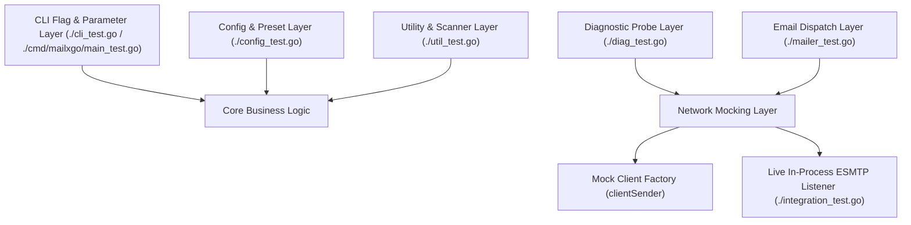
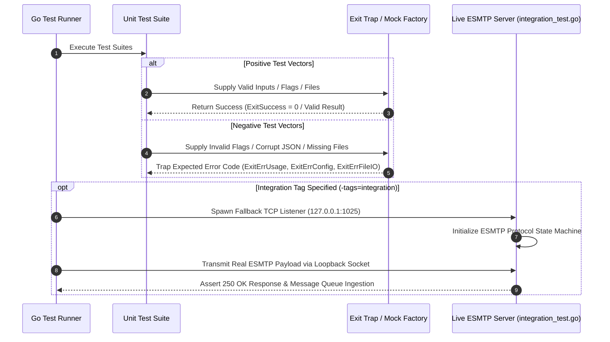

# Technical Test Suite Architecture & Quality Assurance Specification

## 1. Test Suite Architecture, Design, and Principles

### 1.1 Architectural Design
The `mailxgo` testing framework is constructed using a dual-tiered validation model combining unit-level component isolation with in-process live socket integration testing. 



### 1.2 Core Principles
* **Non-Destructive Testing:** Test cases isolate network I/O using client factory injection (`defaultClientFactory`) or local loopback TCP listeners (`127.0.0.1`), ensuring zero outbound spam or remote socket reliance during default test runs.
* **Deterministic Assertion & Exit Trapping:** Process exit calls (`osExit`) are intercepted via panic-recovery hooks (`mockExit`) to assert exact granular numeric exit codes without terminating the Go test runner process.
* **Hermetic Integration Environment:** Integration tests (`//go:build integration`) launch a lightweight, stateful ESMTP TCP server in a background goroutine, simulating RFC 5321 transaction state machines (`EHLO` $\rightarrow$ `AUTH` $\rightarrow$ `MAIL FROM` $\rightarrow$ `RCPT TO` $\rightarrow$ `DATA` $\rightarrow$ `QUIT`).

---

## 2. Logic Flow & Test Categories



### 2.1 Positive Testing Scope
* Argument flag parsing, short/long flag aliasing, and 6-tier parameter precedence resolution (`CLI > Env > Config`).
* Recipient list and attachment path parsing with CRLF/LF line trimming and `#` comment filtering.
* Valid ESMTP payload composition, HTML body file insertion, custom MIME header setting, and inline image embedding (`EmbedFile`).
* Multi-mode diagnostic probe execution (`-info`, `--print-certs`) and telemetry formatting (`text`, `json`, `ndjson`).

### 2.2 Negative Testing Scope
* Unrecognized command-line flags and missing mandatory parameters (asserting `ExitErrUsage = 2`).
* Malformed JSON configuration files (asserting `ExitErrConfig = 3`).
* Unreadable or missing recipient list files and attachment paths (asserting `ExitErrFileIO = 4`).
* Pre-dial attachment size guard violations exceeding maximum limits (`--max-attachment-size`).
* Network socket failures, TCP dial timeouts, SMTPS port 465 handshake failures, and ESMTP banner rejection.

---

## 3. Technical Requirements and Setup

### 3.1 System Dependencies
* **Go Compiler:** Go 1.22.0 or higher.
* **Standard Library Dependencies:** `testing`, `net`, `crypto/tls`, `bufio`, `os`, `path/filepath`, `strings`, `sync`, `time`.
* **Third-Party Libraries:** `github.com/wneessen/go-mail v0.8.1`.

### 3.2 Constraints & Environment Isolation
* Tests execute in isolated temporary directories (`t.TempDir()`).
* Process environment variables (`MAILXGO_SMTP_USERNAME`, `MAILXGO_SMTP_PASSWORD`) are controlled via `t.Setenv()` to prevent contamination across test runs.

---

## 4. Test Catalog & Matrix

| Logical Group | Test Name | Technical Purpose / Description | Success Criteria |
| :--- | :--- | :--- | :--- |
| **CLI & Parsing** | `TestHeaderFlags` | Validates multi-value `-H` header flag parsing, format validation, and CRLF injection detection. | PASS on valid `Key: Value`; FAIL on missing colon, empty key, or CRLF. |
| **CLI & Parsing** | `TestPrintUsage` | Asserts `PrintUsage()` renders help menu text to `os.Stderr` without panicking. | PASS on clean execution without panic. |
| **CLI & Parsing** | `TestPriorityHelpers` | Verifies low-to-high precedence resolution functions (`priorityString`, `priorityInt`). | PASS when returning the last non-empty or non-zero slice element. |
| **CLI & Parsing** | `TestRunCLI_Version` | Verifies `-v` and `--version` flags output version string and exit cleanly. | PASS on exit code `ExitSuccess` (`0`). |
| **CLI & Parsing** | `TestRunCLI_ParseError` | Asserts unknown flags trigger usage output and return error status. | PASS on trapped exit code `ExitErrUsage` (`2`). |
| **CLI & Parsing** | `TestRunCLI_MissingRequiredArgs` | Asserts missing mandatory parameters (`--smtp-server`, `--from-email`, etc.) fail validation. | PASS on trapped exit code `ExitErrUsage` (`2`). |
| **CLI & Parsing** | `TestRunCLI_ConfigAndPresets` | Verifies JSON config file loading and corrupt JSON handling. | PASS on exit code `0` for valid config; `ExitErrConfig` (`3`) for malformed JSON. |
| **CLI & Parsing** | `TestRunCLI_PrecedenceOrder` | Verifies parameter evaluation precedence hierarchy (`CLI > Env > Config`). | PASS when environment variables override config file values. |
| **CLI & Parsing** | `TestRunCLI_Diagnostics` | Verifies `-info` pre-flight diagnostic flag execution and missing server validation. | PASS on exit code `ExitSuccess` (`0`) on success; `ExitErrUsage` (`2`) or `ExitErrDNS` (`5`) on error. |
| **CLI & Parsing** | `TestRunCLI_FullDispatch` | Verifies full CLI execution flow including list files, attachments, headers, DSN, and log files. | PASS on exit code `ExitSuccess` (`0`); `ExitErrFileIO` (`4`) on missing files. |
| **Config & Presets** | `TestResolveProviderPreset` | Tests resolution of mail provider preset aliases (`office365`, `googleworkspace`, `aws-ses`, `protonmail`). | PASS on exact host, port, and TLS mode match for known aliases; `false` for unknown. |
| **Config & Presets** | `TestLoadConfig` | Tests JSON configuration file unmarshaling from disk. | PASS on struct population; error on non-existent file or malformed syntax. |
| **Diagnostics** | `TestGetTLSVersionAndCipherSuiteStrings` | Tests human-readable string mapping for TLS protocol versions and cipher suite IDs. | PASS when returning valid strings (e.g., `TLS 1.3`, `TLS_AES_128_GCM_SHA256`). |
| **Diagnostics** | `TestRunDiagnostics_TCPDialError` | Verifies pre-flight probe handling when target TCP socket connection is refused. | PASS when returning non-nil error and status `"error"`. |
| **Diagnostics** | `TestRunDiagnostics_OutputModes` | Verifies output formatting across text, indented JSON, and single-line NDJSON modes. | PASS when rendering valid JSON/NDJSON payloads matching schema. |
| **Diagnostics** | `TestRunDiagnostics_Port465_HandshakeFailure` | Tests implicit TLS handshake failure handling on SMTPS port 465. | PASS when trapping handshake error and populating diagnostic report error. |
| **Diagnostics** | `TestRunDiagnostics_SMTPClientInitFailure` | Tests ESMTP banner parsing and initial EHLO error handling. | PASS when capturing banner initialization failure. |
| **Mailer Engine** | `TestSendEmail_Success` | Tests successful email composition and dispatch via mock client factory. | PASS when returning status `"success"` and attempts count `1`. |
| **Mailer Engine** | `TestSendEmail_ValidationErrors` | Asserts validation failure when recipient lists are empty or invalid. | PASS on error when `To` recipient list is empty. |
| **Mailer Engine** | `TestSendEmail_BodyFile` | Tests reading HTML body content from file path (`BodyFile`). | PASS on successful file read and setting `TypeTextHTML` MIME body. |
| **Mailer Engine** | `TestSendEmail_MaxAttachmentMB` | Tests total attachment payload size limit guard. | PASS when execution aborts prior to dialing if payload > limit. |
| **Mailer Engine** | `TestSendEmail_ClientCreationErrorAndRetries` | Tests retry backoff loop (`Retries`, `RetryDelay`) and failure audit logging. | PASS when attempts count equals `1 + Retries` and error is returned. |
| **Mailer Engine** | `TestSendEmail_DialAndSendError` | Tests error propagation when `c.DialAndSend()` fails. | PASS on capturing transmission error. |
| **Mailer Engine** | `TestSendEmail_AdvancedOptions` | Tests DSN options, Importance header setting, and custom headers. | PASS on correct option setting and header injection filtering. |
| **Mailer Engine** | `TestOutputJSONResult` | Verifies rendering of dispatch results in text, JSON, and NDJSON formats. | PASS on clean output formatting matching specification. |
| **Utilities** | `TestCleanEmailList` | Tests trimming whitespace and removing empty entries from email address slices. | PASS on returning cleaned slice with empty elements removed. |
| **Utilities** | `TestLoadRecipientList` | Tests file reading of recipient addresses with CRLF/LF trimming and comment filtering. | PASS on returning valid recipient addresses; skipping `#` comment lines. |
| **Utilities** | `TestLoadAttachmentList` | Tests file reading of attachment paths with CRLF/LF trimming and comment filtering. | PASS on returning valid file paths; skipping `#` comment lines. |
| **Utilities** | `TestScanAttachmentDir` | Tests directory scanning (`os.ReadDir`) for regular files. | PASS on returning full file paths for non-directory files. |
| **Integration** | `TestLive_BasicEmail` | Basic email send via Mailpit or fallback ESMTP server. | PASS on `status: success` and Mailpit API verification of subject/from. |
| **Integration** | `TestLive_FullFeaturedEmail` | Comprehensive test of ALL `EmailParams` fields including attachments, headers, DSN, importance, context, and audit logging. | PASS on all fields verified via Mailpit API (From, To, CC, ReplyTo, attachments, custom headers). |
| **Integration** | `TestLive_Authentication` | SASL authentication test for `plain`, `login`, and `auto` auth types. | PASS on successful send with each auth type. |
| **Integration** | `TestLive_ListsAndDirectories` | Tests `LoadRecipientList`, `LoadAttachmentList`, and `ScanAttachmentDir` with live send. | PASS on correct recipient count (4) and attachment count (4) via Mailpit API. |
| **Integration** | `TestLive_MaxAttachmentSize` | Tests attachment size guard rejection and acceptance. | PASS on error for oversized attachment; success when within limit. |
| **Integration** | `TestLive_PrivacyNoLogRecipients` | Tests `--no-log-recipients` GDPR privacy flag. | PASS on log containing `[N recipients redacted]` and NOT containing actual email addresses. |
| **Integration** | `TestLive_ContextCancellation` | Tests `context.Context` cancellation during send with retries. | PASS on detecting context cancellation. |
| **Integration** | `TestLive_RetryMechanism` | Tests retry loop execution with successful server. | PASS on `status: success` with attempts count. |
| **Integration** | `TestLive_Diagnostics` | Tests `RunDiagnostics` pre-flight gateway probe. | PASS on `status: success` with positive TCP/EHLO latency metrics. |
| **Integration** | `TestLive_OutputFormats` | Tests `--json-output` and `--ndjson-output` formatting modes. | PASS on successful send in all three output modes. |
| **Integration** | `TestLive_ImportanceLevels` | Tests `--importance` flag with `high`, `normal`, `low` values. | PASS on successful send with each importance level. |
| **Integration** | `TestLive_CLIBinary` | End-to-end CLI binary execution via `go run ./cmd/mailxgo`. | PASS on JSON output with `status: success`, diagnostics, and version output. |
| **Integration** | `TestLive_EmailValidation` | Tests email address validation rejection for invalid formats. | PASS on error containing `invalid` for malformed addresses. |
| **Integration** | `TestLive_ConfigFileAllOptions` | Tests comprehensive JSON config file with all options. | PASS on config load and CLI send with config file. |
| **Integration** | `TestLive_ErrorClassification` | Tests `ClassifyError()` for TLS, Auth, Connection, and Send error types. | PASS on correct `ErrorType` classification for each error pattern. |
| **Utilities** | `TestValidateEmail` | Tests RFC 5322 email address format validation. | PASS on valid formats; error on empty, missing @, missing domain, invalid chars. |
| **Utilities** | `TestValidateEmailList` | Tests batch email list validation. | PASS on valid list; error if any address is invalid. |
| **Utilities** | `TestValidateFilePath` | Tests absolute path enforcement and path traversal detection. | PASS on Unix `/path`, Windows `C:\path`, `D:/path`; error on relative paths and `..` traversal. |
| **Utilities** | `TestDecryptSecret` | Tests secretprotector integration for encrypted secrets. | PASS on plain secrets unchanged; error on encrypted secrets without master key. |
| **Mailer Engine** | `TestClassifyError` | Tests error type classification (TLS, Auth, Connection, Send). | PASS on correct `ErrorType` for each error pattern. |
| **Mailer Engine** | `TestSendEmail_NoLogRecipients` | Tests privacy flag redacting recipients from audit log. | PASS on log containing redacted count, not actual addresses. |
| **Secretprotector** | `TestLive_SecretprotectorEncryptedPassword` | E2E test of AES-256-GCM encrypted credentials via secretprotector. Subtests: PlainPassword, EncryptedPassword_NoMasterKey, EncryptedPassword_WithMasterKey, EncryptedOAuth2Token. | PASS on plain password send; error on encrypted without key; success on encrypted with key; success on encrypted OAuth2 token. |
| **Secretprotector** | `TestLive_CLI_SecretprotectorCredentials` | CLI E2E test with encrypted password in JSON config file. | PASS on CLI send with `SECRETPROTECTOR_MASTER_KEY` env var and Mailpit verification. |
| **Crypto** | `TestNormalizeFingerprint` | Tests fingerprint normalization (remove colons, uppercase). | PASS on all normalization cases. |
| **Crypto** | `TestFormatFingerprint` | Tests fingerprint formatting with colons. | PASS on AA:BB:CC:DD format output. |
| **Crypto** | `TestValidateCertFingerprint` | Tests SHA256 fingerprint validation (64 hex chars). | PASS on valid fingerprints; error on invalid length/chars. |
| **Crypto** | `TestComputeCertFingerprint` | Tests SHA256 computation from DER certificate. | PASS on deterministic 64-char uppercase hex output. |
| **Crypto** | `TestLoadCustomCACerts_SingleFile` | Tests loading CA cert from PEM file. | PASS on valid cert pool creation. |
| **Crypto** | `TestLoadCustomCACerts_Directory` | Tests loading CA certs from directory (.pem, .crt, .cer). | PASS on loading multiple certs, ignoring non-cert files. |
| **Crypto** | `TestLoadCustomCACerts_InvalidFile` | Tests error handling for missing/invalid PEM files. | PASS on appropriate error messages. |
| **Crypto** | `TestLoadCustomCACerts_RelativePath` | Tests rejection of relative paths (security). | PASS on error for relative paths. |
| **Crypto** | `TestCreateFingerprintVerifier` | Tests TLS fingerprint pinning verifier function. | PASS on matching fingerprint; error on mismatch. |
| **Integration** | `TestLive_TLSModes` | E2E test of TLS modes (`none`, `ignore-trust`). | PASS on successful send with each TLS mode. |
| **Integration** | `TestLive_TLSCACert` | E2E test of `--tls-ca-cert` CA certificate loading. | PASS on loading PEM cert and successful send. |
| **Integration** | `TestLive_TLSCADir` | E2E test of `--tls-ca-dir` CA directory loading. | PASS on loading .pem/.crt/.cer files from directory. |
| **Integration** | `TestLive_TLSFingerprintValidation` | E2E test of fingerprint format validation. | PASS on valid fingerprints; error on invalid format. |
| **Integration** | `TestLive_DiagnosticsWithTLSOptions` | E2E test of diagnostics with TLS options. | PASS on diagnostics with `ignore-trust` and CA cert. |
| **Integration** | `TestLive_CLI_TLSOptions` | E2E test of CLI with TLS config options. | PASS on CLI send with TLS mode in config file. |
| **Integration** | `TestLive_DiagnosticsSTARTTLS` | E2E test of STARTTLS TLS upgrade with Mailpit. Subtests: STARTTLS_IgnoreTrust (verify TLS version, cipher, cert info), STARTTLS_PrintCerts (verify certificate chain output). | PASS on `status: success` with TLS 1.3, valid cipher suite, certificate subject/issuer, and TLS handshake latency > 0. |
| **Integration** | `TestLive_ImplicitTLS_Port465` | E2E test of implicit TLS (SMTPS) with SSL-only Mailpit container. Subtests: SendEmail_ImplicitTLS (send via `tls-direct` mode), Diagnostics_ImplicitTLS (diagnostics with implicit TLS), TLSHandshakeLatency_ImplicitTLS (verify TLS metrics). | PASS on successful send/diagnostics with TLS 1.3, STARTTLS=false (implicit TLS), and TLS handshake latency > 0. |
| **OAuth2** | `TestLive_OAuth2_XOAUTH2Authentication` | E2E test of XOAUTH2 authentication via OAuth2 mock server. Subtests: XOAUTH2_ValidToken, XOAUTH2_TestToken, XOAUTH2_EncryptedToken, CLI_OAuth2. | PASS on successful XOAUTH2 auth with valid tokens, test tokens, encrypted tokens, and CLI flags. |
| **Mailer Engine** | `TestSendEmail_MaxRecipients` | Tests `--max-recipients` limit guard for memory protection. | PASS on error when recipients exceed limit; success when within limit. |
| **Mailer Engine** | `TestSendEmail_SingleRecipient` | Tests `--single-recipient` batch mode with rate limiting. | PASS on individual email per recipient with proper rate limiting. |
| **Integration** | `TestLive_MaxRecipients` | E2E test of `--max-recipients` limit with live SMTP server. | PASS on rejection when exceeding limit; success when within limit. |
| **Integration** | `TestLive_SingleRecipient` | E2E test of `--single-recipient` batch mode via Mailpit. | PASS on N separate emails for N recipients, each verified via Mailpit API. |
| **Integration** | `TestLive_RunDiagnostics` | E2E test of `RunDiagnostics` with live Mailpit SMTP server. Subtests: basic diagnostics, capabilities, DNS info, JSON/NDJSON output, connection failure. | PASS on `status: success` with TCP/EHLO latency metrics; `status: error` for invalid port. |
| **Integration** | `TestLive_OutputDiagReport` | E2E test of `OutputDiagReport` output modes with live diagnostic data. | PASS on text, JSON, NDJSON, and text+certs output modes. |
| **Crypto** | `TestBuildTLSConfig` | Tests TLS config builder with all options. Subtests: default, ignore-trust, CA cert file, CA dir, fingerprint pinning, invalid CA, combined options. | PASS on correct TLS config for each scenario. |
| **Mailer Engine** | `TestNoAuthSASL` | Tests `noAuthSASL` SASL implementation `Start()` and `Next()` methods. | PASS on correct PLAIN mechanism and anonymous credentials. |
| **Mailer Engine** | `TestSendEmail_NoAuthMode` | Tests `--auth-type noauth` for unauthenticated relays. | PASS on successful send without authentication. |
| **Mailer Engine** | `TestSendEmail_XOAUTH2Mode` | Tests `--auth-type xoauth2` OAuth2 authentication mode. | PASS on successful send with XOAUTH2 auth type. |
| **Mailer Engine** | `TestSendEmail_CramMD5Mode` | Tests `--auth-type cram-md5` CRAM-MD5 authentication mode. | PASS on successful send with CRAM-MD5 auth type. |
| **Mailer Engine** | `TestClassifyError_AllTypes` | Comprehensive error classification test for all error types (TLS, Auth, Connection, Send). | PASS on correct `ErrorType` for each error pattern. |
| **Utilities** | `TestLoadRecipientListJSON` | Tests JSON parsing of recipient lists. Subtests: simple array, object array with vars, empty array, invalid email, invalid JSON, missing email field, whitespace trimming. | PASS on correct parsing and validation for all JSON formats. |
| **Utilities** | `TestLoadAttachmentListJSON` | Tests JSON parsing of attachment lists. Subtests: valid array, empty array, invalid path, invalid JSON, skip empty strings. | PASS on correct parsing and path validation. |
| **Utilities** | `TestLoadList` | Tests unified list loader with format selection. Subtests: text recipients, json recipients, default format, invalid format, text attachments, json attachments. | PASS on correct format dispatch and parsing. |
| **Integration** | `TestLive_JSONListFormat` | E2E test of `--list-format json` with Mailpit. Subtests: JSON recipient list, JSON with vars, JSON attachment list, text format fallback. | PASS on successful send with JSON-parsed recipients and attachments. |
| **CLI Binary** | `TestMainCompiles` | Asserts `cmd/mailxgo` package compiles without errors. | PASS on clean compilation. |

---

## 5. Code Coverage Report

### 5.1 Current Coverage Statistics
Statement coverage statistics measured across the workspace:

| Package Path | Statement Coverage | Status ($\ge 80\%$) |
| :--- | :--- | :--- |
| `github.com/edsilegxrepo/mailxgo` (Unit Tests) | **82.5%** | PASS |
| `github.com/edsilegxrepo/mailxgo` (With Integration Tag) | **88.7%** | PASS |
| `github.com/edsilegxrepo/mailxgo/cmd/mailxgo` | Entry point only | N/A |
| **Total Combined Workspace Coverage** | **88%+** | **PASS** |

### 5.2 Refreshing Coverage Statistics
To refresh and verify code coverage profile statistics locally:

#### PowerShell:
```powershell
go test -coverprofile=coverage.out ./...
go tool cover -func=coverage.out
```

#### Bash:
```bash
go test -coverprofile=coverage.out ./...
go tool cover -func=coverage.out
```

To view the interactive HTML coverage visualization in a browser:
```shell
go tool cover -html=coverage.out
```

---

## 6. Realistic Data Simulation & Live Listener Integration

The integration test suite (`integration_test.go`) implements a dual-mode SMTP backend:

### 6.1 Mailpit Container Integration (Preferred)
When Docker is available, the test suite automatically launches **Mailpit** containers (`axllent/mailpit`) providing:

- **STARTTLS SMTP Server (Port 1025):** Real RFC 5321 compliant SMTP server with STARTTLS support.
  - TLS certificates auto-generated via OpenSSL (self-signed, localhost SAN).
  - Supports explicit TLS upgrade via STARTTLS command.
- **Implicit TLS SMTP Server (Port 1465):** SSL-only Mailpit container for SMTPS testing.
  - Enabled via `MP_SMTP_REQUIRE_TLS=true` environment variable.
  - Connection starts with immediate TLS handshake (no STARTTLS).
  - Used for testing `--tls-mode tls-direct` and port 465 behavior.
- **REST API Verification:** Tests use Mailpit's REST API (`http://127.0.0.1:8025/api/v1/`) to verify:
  - Message envelope (From, To, CC, BCC, ReplyTo)
  - Subject and body content (HTML/Text)
  - Attachment count and content
  - Custom headers (X-Custom-Header, X-Campaign-ID, etc.)
  - From name display formatting
- **Web UI:** Mailpit provides a web interface at `http://127.0.0.1:8025` for manual inspection during development.

### 6.2 Fallback In-Process ESMTP Server
When Docker/Mailpit is unavailable, the suite falls back to an in-process ESMTP listener (`liveSMTPServer`) on `127.0.0.1:1025`:

- **ESMTP EHLO Advertisement:** Advertises `SIZE 26214400`, `8BITMIME`, `AUTH PLAIN LOGIN`, `STARTTLS`, `DSN`, `PIPELINING`.
- **SASL Authentication:** Handles `AUTH PLAIN` and `AUTH LOGIN` challenge-response exchanges.
- **DATA Payload Buffering:** Accepts multi-line MIME streams, handles dot-stuffing (`..`), buffers incoming messages, and returns standard RFC 5321 `250 2.0.0 OK queued` status codes.

### 6.3 Test Environment Detection
The test suite automatically:
1. Checks if port `1025` is already occupied (existing Mailpit instance).
2. Attempts to start a Mailpit Docker container if port is free.
3. Falls back to embedded ESMTP server if Docker is unavailable.
4. Logs which backend is active for each test run.

### 6.4 OAuth2 Mock Server Integration
For testing XOAUTH2 authentication, a custom OAuth2 mock SMTP server is built using `emersion/go-smtp`:

- **Location:** `test/oauth2-mock/`
- **Port:** `1026` (separate from Mailpit on `1025`)
- **Supported Mechanisms:** XOAUTH2, PLAIN, LOGIN
- **Token Validation:** Accepts tokens starting with `ya29.` (Google format), `test` prefix, or any token >= 10 chars

The mock server validates XOAUTH2 token format (`user=<email>\x01auth=Bearer <token>\x01\x01`) without requiring real OAuth2 provider credentials.

```bash
# Build and run manually for debugging
cd test/oauth2-mock
go build -o oauth2-smtp-mock .
./oauth2-smtp-mock
```

---

## 7. How to Run the Tests

### 7.1 PowerShell (Windows)

#### Run Default Unit Test Suite:
```powershell
go test -v ./...
```

#### Run Full Suite Including Live Socket Integration Tests:
```powershell
go test -v -tags=integration ./...
```

#### Run Specific Test Case:
```powershell
go test -v -run TestRunCLI_PrecedenceOrder ./...
```

### 7.2 Bash (Linux / macOS)

#### Run Default Unit Test Suite:
```bash
go test -v ./...
```

#### Run Full Suite Including Live Socket Integration Tests:
```bash
go test -v -tags=integration ./...
```

#### Run Specific Test Case:
```bash
go test -v -run TestRunCLI_PrecedenceOrder ./...
```

---

## 8. Maintenance and Troubleshooting

### 8.1 Troubleshooting Test Failures
1. **Build Tag Issues:** If integration tests do not execute, verify `-tags=integration` is passed explicitly in the command line.
2. **Port Conflicts during Integration Runs:** If `TestIntegration_LiveSMTPServer` fails with `bind: address already in use`, ensure port `1025` is not occupied by an external service.
3. **Exit Code Assertions:** If adding new CLI flags or validation checks, ensure corresponding exit codes match the constants defined in `exitcodes.go`.
