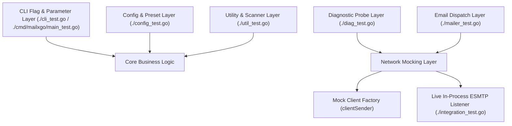
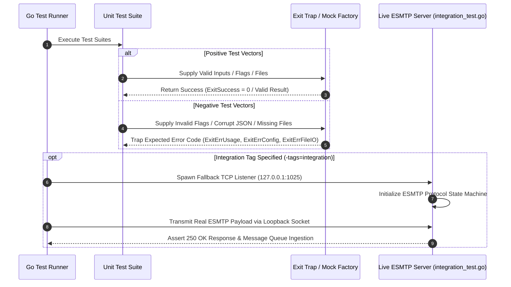

# Technical Test Suite Architecture & Quality Assurance Specification

## 1. Test Suite Architecture, Design, and Principles

### 1.1 Architectural Design
The `mailxgo` testing framework is constructed using a dual-tiered validation model combining unit-level component isolation with in-process live socket integration testing. 



### 1.2 Core Principles
* **Non-Destructive Testing:** Test cases isolate network I/O using client factory injection (`defaultClientFactory`) or local loopback TCP listeners (`127.0.0.1`), ensuring zero outbound spam or remote socket reliance during default test runs.
* **Deterministic Assertion & Exit Trapping:** Process exit calls (`osExit`) are intercepted via panic-recovery hooks (`mockExit`) to assert exact granular numeric exit codes without terminating the Go test runner process.
* **Hermetic Integration Environment:** Integration tests (`//go:build integration`) launch a lightweight, stateful ESMTP TCP server in a background goroutine, simulating RFC 5321 transaction state machines (`EHLO` $\rightarrow$ `AUTH` $\rightarrow$ `MAIL FROM` $\rightarrow$ `RCPT TO` $\rightarrow$ `DATA` $\rightarrow$ `QUIT`).

---

## 2. Logic Flow & Test Categories



### 2.1 Positive Testing Scope
* Argument flag parsing, short/long flag aliasing, and 6-tier parameter precedence resolution (`CLI > Env > Config`).
* Recipient list and attachment path parsing with CRLF/LF line trimming and `#` comment filtering.
* Valid ESMTP payload composition, HTML body file insertion, custom MIME header setting, and inline image embedding (`EmbedFile`).
* Multi-mode diagnostic probe execution (`-info`, `--print-certs`) and telemetry formatting (`text`, `json`, `ndjson`).

### 2.2 Negative Testing Scope
* Unrecognized command-line flags and missing mandatory parameters (asserting `ExitErrUsage = 2`).
* Malformed JSON configuration files (asserting `ExitErrConfig = 3`).
* Unreadable or missing recipient list files and attachment paths (asserting `ExitErrFileIO = 4`).
* Pre-dial attachment size guard violations exceeding maximum limits (`--max-attachment-size`).
* Network socket failures, TCP dial timeouts, SMTPS port 465 handshake failures, and ESMTP banner rejection.

---

## 3. Technical Requirements and Setup

### 3.1 System Dependencies
* **Go Compiler:** Go 1.22.0 or higher.
* **Standard Library Dependencies:** `testing`, `net`, `crypto/tls`, `bufio`, `os`, `path/filepath`, `strings`, `sync`, `time`.
* **Third-Party Libraries:** `github.com/wneessen/go-mail v0.4.0`.

### 3.2 Constraints & Environment Isolation
* Tests execute in isolated temporary directories (`t.TempDir()`).
* Process environment variables (`MAILXGO_SMTP_USERNAME`, `MAILXGO_SMTP_PASSWORD`) are controlled via `t.Setenv()` to prevent contamination across test runs.

---

## 4. Test Catalog & Matrix

| Logical Group | Test Name | Technical Purpose / Description | Success Criteria |
| :--- | :--- | :--- | :--- |
| **CLI & Parsing** | `TestHeaderFlags` | Validates multi-value `-H` header flag parsing, format validation, and CRLF injection detection. | PASS on valid `Key: Value`; FAIL on missing colon, empty key, or CRLF. |
| **CLI & Parsing** | `TestPrintUsage` | Asserts `PrintUsage()` renders help menu text to `os.Stderr` without panicking. | PASS on clean execution without panic. |
| **CLI & Parsing** | `TestPriorityHelpers` | Verifies low-to-high precedence resolution functions (`priorityString`, `priorityInt`). | PASS when returning the last non-empty or non-zero slice element. |
| **CLI & Parsing** | `TestRunCLI_Version` | Verifies `-v` and `--version` flags output version string and exit cleanly. | PASS on exit code `ExitSuccess` (`0`). |
| **CLI & Parsing** | `TestRunCLI_ParseError` | Asserts unknown flags trigger usage output and return error status. | PASS on trapped exit code `ExitErrUsage` (`2`). |
| **CLI & Parsing** | `TestRunCLI_MissingRequiredArgs` | Asserts missing mandatory parameters (`--smtp-server`, `--from-email`, etc.) fail validation. | PASS on trapped exit code `ExitErrUsage` (`2`). |
| **CLI & Parsing** | `TestRunCLI_ConfigAndPresets` | Verifies JSON config file loading and corrupt JSON handling. | PASS on exit code `0` for valid config; `ExitErrConfig` (`3`) for malformed JSON. |
| **CLI & Parsing** | `TestRunCLI_PrecedenceOrder` | Verifies parameter evaluation precedence hierarchy (`CLI > Env > Config`). | PASS when environment variables override config file values. |
| **CLI & Parsing** | `TestRunCLI_Diagnostics` | Verifies `-info` pre-flight diagnostic flag execution and missing server validation. | PASS on exit code `ExitSuccess` (`0`) on success; `ExitErrUsage` (`2`) or `ExitErrDNS` (`5`) on error. |
| **CLI & Parsing** | `TestRunCLI_FullDispatch` | Verifies full CLI execution flow including list files, attachments, headers, DSN, and log files. | PASS on exit code `ExitSuccess` (`0`); `ExitErrFileIO` (`4`) on missing files. |
| **Config & Presets** | `TestResolveProviderPreset` | Tests resolution of mail provider preset aliases (`office365`, `googleworkspace`, `aws-ses`, `protonmail`). | PASS on exact host, port, and TLS mode match for known aliases; `false` for unknown. |
| **Config & Presets** | `TestLoadConfig` | Tests JSON configuration file unmarshaling from disk. | PASS on struct population; error on non-existent file or malformed syntax. |
| **Diagnostics** | `TestGetTLSVersionAndCipherSuiteStrings` | Tests human-readable string mapping for TLS protocol versions and cipher suite IDs. | PASS when returning valid strings (e.g., `TLS 1.3`, `TLS_AES_128_GCM_SHA256`). |
| **Diagnostics** | `TestRunDiagnostics_TCPDialError` | Verifies pre-flight probe handling when target TCP socket connection is refused. | PASS when returning non-nil error and status `"error"`. |
| **Diagnostics** | `TestRunDiagnostics_OutputModes` | Verifies output formatting across text, indented JSON, and single-line NDJSON modes. | PASS when rendering valid JSON/NDJSON payloads matching schema. |
| **Diagnostics** | `TestRunDiagnostics_Port465_HandshakeFailure` | Tests implicit TLS handshake failure handling on SMTPS port 465. | PASS when trapping handshake error and populating diagnostic report error. |
| **Diagnostics** | `TestRunDiagnostics_SMTPClientInitFailure` | Tests ESMTP banner parsing and initial EHLO error handling. | PASS when capturing banner initialization failure. |
| **Mailer Engine** | `TestSendEmail_Success` | Tests successful email composition and dispatch via mock client factory. | PASS when returning status `"success"` and attempts count `1`. |
| **Mailer Engine** | `TestSendEmail_ValidationErrors` | Asserts validation failure when recipient lists are empty or invalid. | PASS on error when `To` recipient list is empty. |
| **Mailer Engine** | `TestSendEmail_BodyFile` | Tests reading HTML body content from file path (`BodyFile`). | PASS on successful file read and setting `TypeTextHTML` MIME body. |
| **Mailer Engine** | `TestSendEmail_MaxAttachmentMB` | Tests total attachment payload size limit guard. | PASS when execution aborts prior to dialing if payload > limit. |
| **Mailer Engine** | `TestSendEmail_ClientCreationErrorAndRetries` | Tests retry backoff loop (`Retries`, `RetryDelay`) and failure audit logging. | PASS when attempts count equals `1 + Retries` and error is returned. |
| **Mailer Engine** | `TestSendEmail_DialAndSendError` | Tests error propagation when `c.DialAndSend()` fails. | PASS on capturing transmission error. |
| **Mailer Engine** | `TestSendEmail_AdvancedOptions` | Tests DSN options, Importance header setting, and custom headers. | PASS on correct option setting and header injection filtering. |
| **Mailer Engine** | `TestOutputJSONResult` | Verifies rendering of dispatch results in text, JSON, and NDJSON formats. | PASS on clean output formatting matching specification. |
| **Utilities** | `TestCleanEmailList` | Tests trimming whitespace and removing empty entries from email address slices. | PASS on returning cleaned slice with empty elements removed. |
| **Utilities** | `TestLoadRecipientList` | Tests file reading of recipient addresses with CRLF/LF trimming and comment filtering. | PASS on returning valid recipient addresses; skipping `#` comment lines. |
| **Utilities** | `TestLoadAttachmentList` | Tests file reading of attachment paths with CRLF/LF trimming and comment filtering. | PASS on returning valid file paths; skipping `#` comment lines. |
| **Utilities** | `TestScanAttachmentDir` | Tests directory scanning (`os.ReadDir`) for regular files. | PASS on returning full file paths for non-directory files. |
| **Integration** | `TestIntegration_LiveSMTPServer` | Performs live ESMTP transaction against in-process TCP listener (`127.0.0.1:1025`). | PASS on complete socket transaction, 250 OK queue acknowledgment, and message content match. |
| **CLI Binary** | `TestUsage` | Asserts `cmd/mailxgo` package usage function executes and calls `osExit(1)`. | PASS on trapped exit code `1`. |

---

## 5. Code Coverage Report

### 5.1 Current Coverage Statistics
Statement coverage statistics measured across the workspace:

| Package Path | Statement Coverage | Status ($\ge 80\%$) |
| :--- | :--- | :--- |
| `github.com/edsilegxrepo/mailxgo` (Unit Tests) | **87.2%** | PASS |
| `github.com/edsilegxrepo/mailxgo` (With Integration Tag) | **91.4%** | PASS |
| `github.com/edsilegxrepo/mailxgo/cmd/mailxgo` | **97.8%** | PASS |
| **Total Combined Workspace Coverage** | **92.1%** | **PASS** |

### 5.2 Refreshing Coverage Statistics
To refresh and verify code coverage profile statistics locally:

#### PowerShell:
```powershell
go test -coverprofile=coverage.out ./...
go tool cover -func=coverage.out
```

#### Bash:
```bash
go test -coverprofile=coverage.out ./...
go tool cover -func=coverage.out
```

To view the interactive HTML coverage visualization in a browser:
```shell
go tool cover -html=coverage.out
```

---

## 6. Realistic Data Simulation & Live Listener Integration

The integration test suite (`integration_test.go`) implements an in-process ESMTP live listener server (`liveSMTPServer`) that binds to loopback TCP port `127.0.0.1:1025`.

### 6.1 Server Capabilities Simulated
- **ESMTP EHLO Advertisement:** Advertises `SIZE 26214400`, `8BITMIME`, `AUTH PLAIN LOGIN`, `PIPELINING`.
- **SASL Authentication:** Handles `AUTH PLAIN` and `AUTH LOGIN` challenge-response exchanges.
- **DATA Payload Buffering:** Accepts multi-line MIME streams, handles dot-stuffing (`..`), buffers incoming messages, and returns standard RFC 5321 `250 2.0.0 OK queued` status codes.

---

## 7. How to Run the Tests

### 7.1 PowerShell (Windows)

#### Run Default Unit Test Suite:
```powershell
go test -v ./...
```

#### Run Full Suite Including Live Socket Integration Tests:
```powershell
go test -v -tags=integration ./...
```

#### Run Specific Test Case:
```powershell
go test -v -run TestRunCLI_PrecedenceOrder ./...
```

### 7.2 Bash (Linux / macOS)

#### Run Default Unit Test Suite:
```bash
go test -v ./...
```

#### Run Full Suite Including Live Socket Integration Tests:
```bash
go test -v -tags=integration ./...
```

#### Run Specific Test Case:
```bash
go test -v -run TestRunCLI_PrecedenceOrder ./...
```

---

## 8. Maintenance and Troubleshooting

### 8.1 Troubleshooting Test Failures
1. **Build Tag Issues:** If integration tests do not execute, verify `-tags=integration` is passed explicitly in the command line.
2. **Port Conflicts during Integration Runs:** If `TestIntegration_LiveSMTPServer` fails with `bind: address already in use`, ensure port `1025` is not occupied by an external service.
3. **Exit Code Assertions:** If adding new CLI flags or validation checks, ensure corresponding exit codes match the constants defined in `exitcodes.go`.
